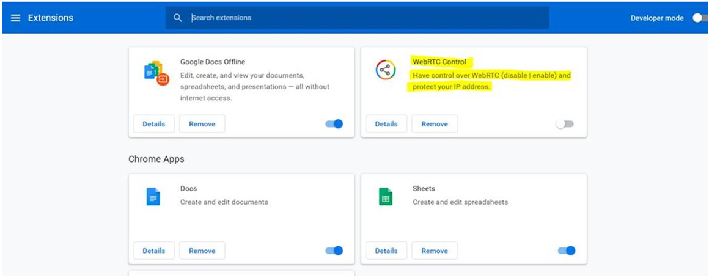

# Troubleshooting

Here are some basic tips for troubleshooting common issues with OneConsultation: 

## Public User Troubleshooting

### I cannot access the consultation

Things to check: 
 * The URL spelling is correct
 * Your device is connected to the Internet
 * The microphone and camera on your device are enabled 
 * You are using a supported device/browser. You can find a list of these [here](browsers.md). Using Chrome on an IOS device will result in the OneConsultation webpage constantly trying to load without success. 

### The audio/video quality of my consultation is poor (video is freezing, sound is dropping out etc)

Please check your Internet connection. 

A wired connection is recommended wherever possible. If a wired connection is unavailable, try to use a good wifi connection. Avoid wifi in public spaces that is shared among lots of people. 

If you're using your home wifi, keep close to the router if you can, and check that nobody else in the house is using your  wifi to stream games or tv/film at the same time as your consultation. Also, check the number of devices connected to your wifi, as connected devices consume bandwidth. 

If your wifi connection is poor or not available, a minimum of 4G is required. 
Please also check that you are using a supported device/browser - you can find this list [here](browsers.md). 

### The consultation has started but I cannot see any video

Check that your consultant has their camera enabled. 

### The consultation has started but I cannot hear any audio

Check that your device audio is enabled. 

### The consultation has started but the consultant cannot see my video / hear my audio 

Things to check: 
* Your device camera and microphone are both enabled 
* Your device isn't muted 

### I've received Error Message 4 when trying to connect to the OneConsultation service

This error code means that the web browser doesn't have access to use the camera and microphone. Please refresh the page, and when prompted, allow OneConsultation to access your device's camera and microphone. 

### I'm using Chrome but still can't connect to OneConsultation 

Check whether a Chrome extension called WebRTC Control is turned on - if so, this may be causing your issue. Turn off the extension and try again. 

## O365 User Troubleshooting

### One of my virtual waiting rooms is missing from my list

Please check with your local IT that you are included in the AD Security group for access to that waiting room. 

### I have tried to join a consultation using Microsoft Teams but there is no way to start the video call

Please use Microsoft Teams to test call testcall@onecvideo.net. 

Here's how to do this:
* Use the search/command bar at the top of your Microsoft Teams screen to search for testcall@onecvideo.net. 
* When prompted, choose 'search externally'. 
* When you click on the address - you should find that you are able to use the call/video call buttons as if you were calling an existing contact within Microsoft Teams. Use these buttons to make a test call to that address. Once the test call is complete, the issue should be resolved. 

### The audio/video quality of my consultation is poor (video is freezing, sound is dropping out etc)

Please check your Internet connection. 

A wired connection is recommended wherever possible. If a wired connection is unavailable, try to use a good wifi connection. Avoid wifi in public spaces that is shared among lots of people. 

If you're using your home wifi, keep close to the router if you can, and check that nobody else in the house is using your  wifi to stream games or tv/film at the same time as your consultation. Also, check the number of devices connected to your wifi, as connected devices consume bandwidth. 

If your wifi connection is poor or not available, a minimum of 4G is required. 
Please also check that you are using a supported device/browser - you can find this list [here](browsers.md).

### The consultation has started but I am the only one in it - my public user is saying the same thing

It is likely that you are both in separate consultations. 

This can sometimes happen if a public user drops out of a consultation, and then uses the public portal URL to regain access. We recommend both parties leaving the consultation and starting the process again from the beginning.

Each time a public user uses the portal, a new consultation is created. As an O365 user, you should always join a consultation via the admin portal to ensure you are joining the correct consultation. 

### When I click 'enter room' - Microsoft Teams launches but the consultation chat does not display, so I can't join the consultation 

This is a known issue. At present, the fix is to click 'enter room' twice, or use a web based version of the admin portal. 
Please contact your local IT team for more information. 
